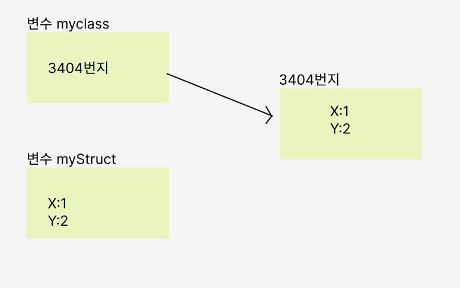

# 구조체와 클래스 차이

구조체도 클래스와 마찬가지로 new 연산자를 사용해 객체를 생성

```cpp
DateTime date = new DateTime(2023,9,2);
```

사용법도 클래으와 비슷함, 구조체에도 속성과 메서드가 있어 클래스처럼 이용 할 수 있음

```cpp
DateTime date = new DateTime(2023,9,2);
int year = date.Year;
```

#### 구조체와 클래스는 객체를 메모리 상에 저장하는 방식의 차이

```cpp
class MyClass {
  public int X{get;set}
  public int Y{get;set}
}

struct MyStruct {
  public int X{get;set}
  public int Y{get;set}
}


MyClass myclas = new MyClass{X=1, Y=2};
MyStruct myclas = new MyStruct{X=1, Y=2};

```

<br>
<br>



클래스는 변수가 있는 곳과 다른 곳에 객체의 영역이 확보되고 변수에는 그 참조가 저장됨
구조체는 변수 자체에 객체가 저장 됨
