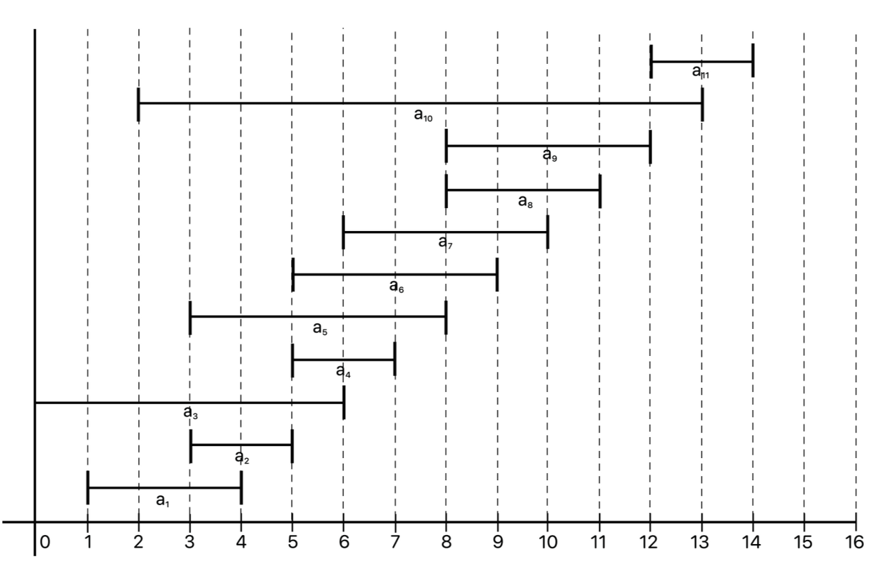

#그리디 알고리즘

### :exclamation: 그리티 알고리즘(탐욕 알고리즘)

:point_right: 선택의 순간마다 당장 눈 앞에 보이는 최적의 상황만을 쫒아 최종적인 해답이 도달하는 방법

:point_right: 탐욕 알고리즘은 여러 경우 중 하나를 결정해야 할 때마다 그 순간에 최적이라고 생각되는 것을 선택해 나가는 방식으로 진행하여 최종적인 해답에 도달

#### :point_right: 탐욕 알고리즘 문제를 해결하는 방법

1. 선택절차 : 현재 상태에서의 최적의 해답을 선택
2. 적절성 검사 : 선택된 해가 문제의 조건을 만족하는지 검사
3. 해답 검사 : 원래의 문제가 해결되었는지 검사, 해결되지 않았으면 위의 과정을 반복

### :point_right: 그리디 알고리즘 정당성 증명

그리디 알고리즘의 정당성 증명은 많은 경우 일정한 패턴을 가진다.<br>
이 증명 패턴은 그리드 알고리즘이 항상 최적해를 찾아 낼 수 있따는 것을 두 가지 속성을 증명함으로써 보인다.

- 탐욕스런 선택 조건 : 앞의 선택이 이후의 선택에 영향을 주지 않는 것
- 최적 부분 구조 조건 : 문제에 대한 최적해가 부분문제에 대해서도 역시 최적해라는 것

위의 두 조건이 만족하지 않는다면?
-> 두 조건이 성립되지 않으면 최적해를 구하지 못한다
-> 이러한 경우 근사 알고리즘으로 사용이 가능하다( 계산 속도가 빨라 실용적임)

어떤 특별한 구조가 있는 경우 탐욕 알고리즘은 언제나 최적해를 찾아 낼 수 있음
이 구조를 매트로이드라고 함

> 탐욕 알고리즘은 항상 최적의 결과를 도출하는 것은 아님.
> 어느 정도 최적에 근사한 값을 빠르게 도출하는 장점이 있음

> 그리드 알고리즘을 적용해도 언제나 최적해를 구할 수 있는 문제(매트로이드)가 있고, 이러한 문제에 그리드 알고리즘을 사용해서 빠른 계산 속도로 답을 구할 수 있다.

### 근사 알고리즘?

- 어떤 최적화 문제에 대한 해의 근사값을 구하는 알고리즘
- 가장 최적화 되는 답을 구할 수 는 없지만, 빠른 시간에 계산이 가능하고 어느 정도 보장된 근사해를 계산 한다

## 문제

[백준 1931번 회의실](https://www.acmicpc.net/problem/1931)

### 설명

한 개의 회의실이 있는데 이를 사용하고자 하는 N개의 회의에 대하여 회의실 사용표를 만들려고 한다. 각 회의 I에 대해 시작시간과 끝나는 시간이 주어져 있고, 각 회의가 겹치지 않게 하면서 회의실을 사용할 수 있는 회의의 최대 개수를 찾아보자. 단, 회의는 한번 시작하면 중간에 중단될 수 없으며 한 회의가 끝나는 것과 동시에 다음 회의가 시작될 수 있다. 회의의 시작시간과 끝나는 시간이 같을 수도 있다. 이 경우에는 시작하자마자 끝나는 것으로 생각하면 된다.

### 입력

첫째 줄에 회의의 수 N(1 ≤ N ≤ 100,000)이 주어진다. 둘째 줄부터 N+1 줄까지 각 회의의 정보가 주어지는데 이것은 공백을 사이에 두고 회의의 시작시간과 끝나는 시간이 주어진다. 시작 시간과 끝나는 시간은 231-1보다 작거나 같은 자연수 또는 0이다

### 출력

첫째 줄에 최대 사용할 수 있는 회의의 최대 개수를 출력한다.

### 풀이

1. 회의가 빨리 끝나는 순서대로 정렬한다
2. 이전 종료시간에 대해 겹치는 것을 제외하고 남은 것들 중 선택한다.

##### :exclamation: 끝나는 시간이 같을 경우에는 일찍 시작을 해야 최대한 더 많이 이용할 수 있다.

쉽게 말하면 아래처럼 되어있는 회의 시간표를


이런 식으로 정리하는 것이다


내 코드

```js
//데이터 불러오고 필요한 형태로 매핑
/*
11
1 4
3 5
0 6
5 7
3 8
5 9
6 10
8 11
8 12
2 13
12 14 
이 데이터를 아래와 같이
arr = [  "1 4",  "3 5",  "0 6",  "5 7",  "3 8",  "5 9",  "6 10",  "8 11",  "8 12",  "2 13",  "12 14"]
*/
const fs = require("fs");
const file = process.platform === "linux" ? "/dev/stdin" : "./input.txt";
const input = fs.readFileSync(file).toString().trim().split("\n");
const [n, ...arr] = input;

let answer = 0;

//끝나는 시간 기준 오름차순으로 정렬
//끝나는 시간이 같을 경우 더 일찍 시작하는게 우선
const times = arr
  .map((num) => num.split(" ").map((num) => +num))
  .sort((a, b) => {
    if (a[1] === b[1]) {
      return a[0] - b[0];
    } else {
      return a[1] - b[1];
    }
  });

let et = 0; // 최근 회의실을 이용하고 끝나는 시간을 저장
times.forEach((time) => {
  if (time[0] >= et) {
    //시작 시간이 최근에 끝난 시간 값보다 크거나 같으면 이용
    answer++;
    et = time[1];
  }
});

console.log(answer);
```
